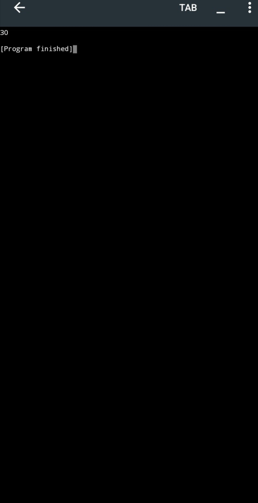

📚 Data Structures & Algorithms in C++

A structured and continuously evolving repository focused on learning, implementing, and understanding Data Structures and Algorithms using C++.

This repository documents my progress from fundamental data structures to advanced algorithmic concepts, with an emphasis on logical thinking, clean implementation, problem solving, and computational efficiency.

---

🎯 About This Repository

Data Structures and Algorithms are fundamental areas of Computer Science that help in designing efficient and scalable solutions to computational problems.

This repository is created to develop a strong understanding of:

- Data Structures
- Algorithms
- Problem Solving
- Algorithmic Thinking
- Time Complexity
- Space Complexity
- C++ Implementation
- Efficient Programming

The focus is on understanding concepts and implementing them independently, rather than simply collecting code.

---

🧠 Learning Objectives

The main objectives of this repository are to:

- Build strong DSA fundamentals.
- Improve logical and analytical thinking.
- Understand how different data structures work internally.
- Implement algorithms using C++.
- Analyze algorithm efficiency.
- Compare different approaches to solving problems.
- Develop better problem-solving skills.
- Prepare for more advanced Computer Science concepts.

---

📚 Topics

1. Arrays

Arrays are fundamental linear data structures used to store multiple elements of the same type in contiguous memory.

Topics include:

- Array Declaration
- Array Initialization
- User Input
- Output
- Array Traversal
- Searching
- [Searching](./Arrays/array_searching.cpp)

- Insertion
- - [Array Insertion](./Arrays/arrays_insertion.cpp)

- deletion 
- - [Deletion](./Arrays/array_deletion.cpp)

- Updating Elements
- Basic Array Problems
- array output
- 
- 

---

2. Strings

Strings are sequences of characters used for representing and processing textual data.

Topics include:

- String Input
- String Traversal
- Character Processing
- Searching
- String Manipulation
- Basic String Problems

---

3. Pointers

Pointers provide a way to work with memory addresses and are an important part of understanding C++ memory management.

Topics include:

- Pointer Basics
- Addresses
- Dereferencing
- Pointer Arithmetic
- Pointers and Arrays
- Dynamic Memory Concepts

---

4. Searching Algorithms

Searching algorithms are used to locate specific elements within a data structure.

Topics include:

- Linear Search
- Binary Search
- Comparison of Searching Techniques
- Complexity Analysis

---

5. Sorting Algorithms

Sorting algorithms arrange data according to a particular order.

Topics include:

- Bubble Sort
- Selection Sort
- Insertion Sort
- Sorting Comparisons
- Time Complexity Analysis

---

6. Linked Lists

Linked Lists are dynamic linear data structures consisting of connected nodes.

Topics include:

- Node Structure
- Singly Linked List
- Doubly Linked List
- Circular Linked List
- Traversal
- Insertion
- Deletion
- Searching

---

7. Stack

A Stack follows the LIFO (Last In, First Out) principle.

Topics include:

- Stack Concept
- Push
- Pop
- Peek
- Stack Implementation
- Applications of Stack

---

8. Queue

A Queue follows the FIFO (First In, First Out) principle.

Topics include:

- Queue Concept
- Enqueue
- Dequeue
- Front
- Rear
- Circular Queue
- Queue Applications

---

9. Recursion

Recursion is a technique in which a function calls itself to solve smaller versions of a problem.

Topics include:

- Recursive Functions
- Base Cases
- Recursive Calls
- Recursive Problem Solving
- Applications of Recursion

---

10. Trees

Trees are hierarchical data structures consisting of nodes connected through relationships.

Topics include:

- Tree Terminology
- Binary Trees
- Tree Traversal
- Preorder
- Inorder
- Postorder
- Binary Search Trees
- Searching
- Insertion
- Deletion

---

11. Heaps & Priority Queues

Heaps are specialized tree-based structures commonly used for priority-based processing.

Topics include:

- Heap Concept
- Min Heap
- Max Heap
- Heap Operations
- Priority Queue
- Heap Applications

---

12. Graphs

Graphs represent relationships between different entities using vertices and edges.

Topics include:

- Graph Terminology
- Adjacency Matrix
- Adjacency List
- Breadth-First Search (BFS)
- Depth-First Search (DFS)
- Graph Traversal

---

13. Advanced Algorithms

After developing the core DSA foundation, the repository will gradually explore:

- Divide and Conquer
- Greedy Algorithms
- Backtracking
- Dynamic Programming
- Algorithm Optimization
- Advanced Problem Solving

---

📊 Complexity Analysis

Algorithm efficiency is an important part of this learning journey.

For major algorithms, the repository will consider:

Concept| Meaning
Time Complexity| How the running time grows with input size
Space Complexity| How additional memory usage grows
Big O Notation| Describes the growth rate of an algorithm
Best Case| Most favorable input situation
Average Case| Expected or typical behavior
Worst Case| Least favorable input situation

Understanding complexity helps determine which solution is more suitable for a particular problem.

---

🔍 Learning Methodology

Each topic is approached through a consistent learning process:

1. Understand the concept.
2. Study the underlying logic.
3. Write the implementation in C++.
4. Test the program with different inputs.
5. Observe the output and behavior.
6. Analyze time and space complexity.
7. Identify possible improvements.
8. Add the implementation to the repository.

The purpose is to develop understanding, implementation ability, and problem-solving skills together.

---

📁 Repository Structure

Data-Structures-and-Algorithms/
│
├── Arrays/
│   ├── Array_Traversal.cpp
│   ├── Array_Input.cpp
│   ├── Array_Searching.cpp
│   └── ...
│
├── Strings/
│   ├── String_Input.cpp
│   ├── String_Traversal.cpp
│   └── ...
│
├── Pointers/
│   └── ...
│
├── Searching/
│   ├── Linear_Search.cpp
│   ├── Binary_Search.cpp
│   └── ...
│
├── Sorting/
│   ├── Bubble_Sort.cpp
│   ├── Selection_Sort.cpp
│   ├── Insertion_Sort.cpp
│   └── ...
│
├── Linked_List/
│   └── ...
│
├── Stack/
│   └── ...
│
├── Queue/
│   └── ...
│
├── Recursion/
│   └── ...
│
├── Trees/
│   └── ...
│
├── Heaps/
│   └── ...
│
├── Graphs/
│   └── ...
│
└── README.md

The repository is organized by topic to make the learning journey structured, readable, and easy to review.

---

📈 Progress

Arrays

- Array Basics
- Array Input
- Array Output
- Array Traversal
- Searching
- Insertion
- Deletion
- Advanced Array Problems

Strings

- String Basics
- String Input
- String Traversal
- String Processing

Pointers

- Pointer Basics
- Addresses
- Dereferencing
- Pointer Arithmetic

Searching

- Linear Search
- Binary Search

Sorting

- Bubble Sort
- Selection Sort
- Insertion Sort

Linked Lists

- Singly Linked List
- Doubly Linked List
- Circular Linked List

Stack & Queue

- Stack
- Queue
- Circular Queue

Recursion

- Recursive Functions
- Recursive Problem Solving

Trees

- Binary Tree
- Tree Traversals
- Binary Search Tree

Heaps

- Min Heap
- Max Heap
- Priority Queue

Graphs

- BFS
- DFS
- Graph Representation

Advanced Algorithms

- Divide and Conquer
- Greedy Algorithms
- Backtracking
- Dynamic Programming

---

💡 Problem-Solving Philosophy

«Understand the problem → Build the logic → Write the code → Test the solution → Analyze the complexity → Improve»

Programming is not only about producing a working output. It is also about understanding the reasoning behind a solution and considering how efficiently it performs.

---

🛠️ Technologies & Tools

Programming Language

- C++

Development

- C++ Compiler
- C++ Development Environment

Version Control

- Git
- GitHub

---

🌱 Current Focus

Currently, the primary focus is on strengthening the fundamentals of Data Structures and Algorithms using C++.

The repository will grow gradually as new concepts are studied, implemented, tested, and understood.

---

🎓 Academic Direction

This repository is part of a broader Computer Science learning journey.

The long-term objective is to develop strong foundations in programming, algorithms, problem solving, and Computer Science while maintaining consistent academic progress.

A major long-term academic aspiration is to pursue higher education opportunities in South Korea, particularly opportunities that support international students through programs such as the Global Korea Scholarship (GKS).

This repository is intended to serve as a transparent record of continuous technical learning and development.

---

🚀 Future Goals

- Strengthen C++ programming fundamentals
- Master Data Structures and Algorithms
- Improve algorithmic problem solving
- Build meaningful Computer Science projects
- Develop a professional GitHub portfolio
- Maintain strong academic performance
- Continue learning Korean
- Explore advanced Computer Science topics
- Participate in technical and academic opportunities
- Prepare for future international education opportunities

---

📌 Repository Philosophy

This repository is a record of continuous learning.

New implementations, algorithms, exercises, complexity analysis, and projects will be added progressively as new concepts are learned.

Learn → Implement → Test → Analyze → Improve

---

🌏 Long-Term Vision

The long-term vision is to become a strong Computer Science student and continue developing both academically and technically.

Every program in this repository represents another step toward stronger programming fundamentals, deeper algorithmic understanding, and future academic opportunities.

---

👩‍💻 Author

* name: nimrariqat
* email : nimrariqat62@gmail.com 
* GitHub: nimrariqat62_pixel
 
Computer Science Student | C++ | Data Structures | Algorithms | Problem Solving

📍 Pakistan

🎓 Aspiring Computer Scientist

🌏 Long-Term Academic Goal: Higher Education in South Korea

«Building my skills one concept, one program, and one step at a time.»

